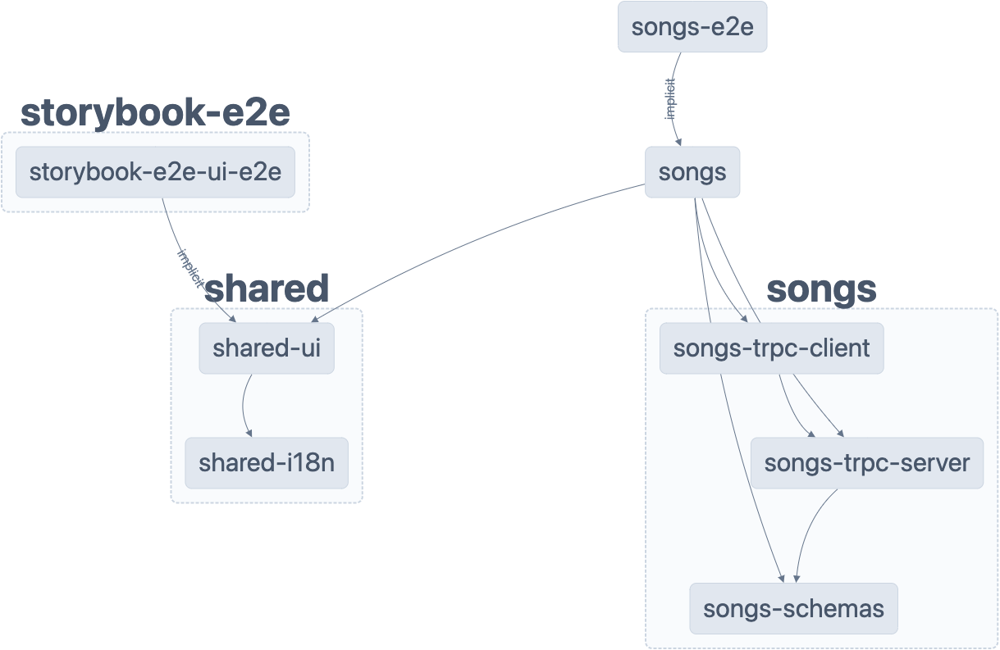
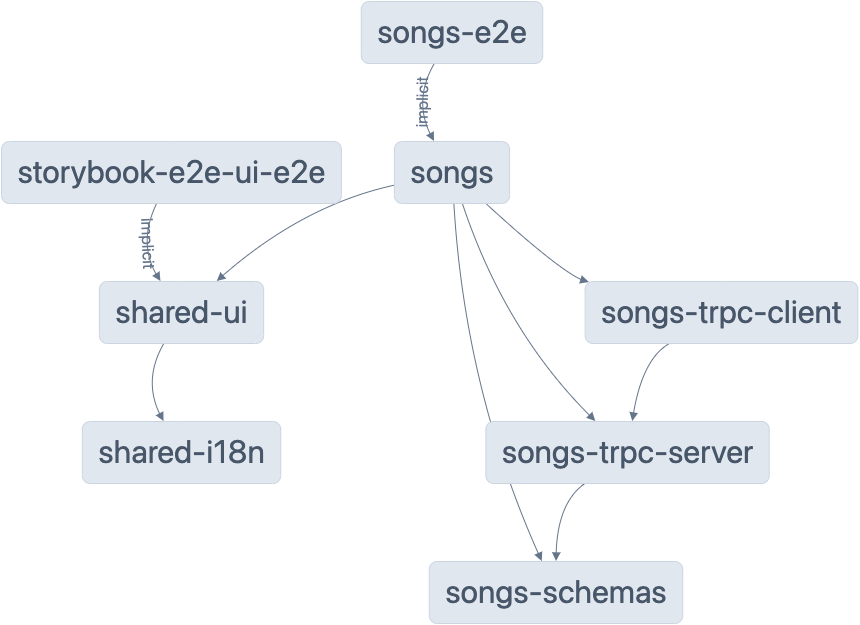

# Hear

## Demo

[](https://hear-dankreiger.vercel.app)

## Design System

[](https://www.chromatic.com/library?appId=639700cc5f8c73291feef9e9)

## Tech Stack

- [nx](https://nx.dev) - Monorepo
- [Next.js](https://nextjs.org) - React Framework
- [Tailwind](https://tailwindcss.com) - CSS Framework
- [Storybook](https://storybook.js.org) - Component Library
- [Chromatic](https://www.chromatic.com) - Storybook Hosting
- [Vercel](https://vercel.com) - Deployment
- [Jest](https://jestjs.io) - Testing
- [Cypress](https://www.cypress.io) - E2E Testing
- [ESLint](https://eslint.org) - Linting
- [Prettier](https://prettier.io) - Code Formatting
- [TRPC](https://trpc.io) - API Framework

## Structure

There are more connections than are actually happening in runtime. It would be nice if nx could generate a diagram of the runtime connections.
The lines also include type-only imports. A lot of these cannot be put into a separate repo since the types are declared via `typeof` on a runtime import.
TRPC is a good example of this. The magic of TRPC is the automatic sharing of types between the client and server. This is done by using `typeof` on a runtime import. Declaring this types separately would be really hard.

- The app is called songs.

- It has a feature library with some packages.

<div style="display: flex;">
  <div style="margin-right: 5px;">
    <h3>Grouped View</h3>
    
  </div>
  <div style="margin-left: 5px;">
    <h3>Ungrouped View</h3>
    
  </div>
</div>

## Notes

- Tailwind is more performant than css-in-js, but the verbose syntax is hard to get used to.
- Naming stuff in a monorepo is hard.
- I tried TRPC. I think I like it, but they could make their API a little more intuitive (too many cross imports).

## TODO

- Add i18n routing into Next.js app
- Write out e2e / integration tests
- Add perf checks / code coverage to CI/CD

## Getting Started

```sh
npm install
npm run dev

# follow the prompt
```

## Note

- The security vulnerabilities upon running `npm install` are from storybook.
- The deprecation outputs upon running the `shared-ui` storybook are from storybook.

These points cannot be easily mitigated until storybook updates their dependencies.

## Understand this workspace

Run `nx graph` to see a diagram of the dependencies of the projects.

## Remote caching

Run `npx nx connect-to-nx-cloud` to enable [remote caching](https://nx.app) and make CI faster.

## Further help

Visit the [Nx Documentation](https://nx.dev) to learn more.
