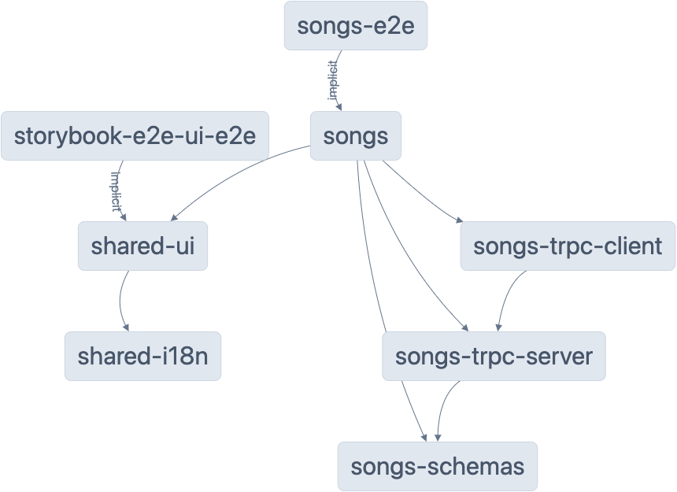

# Notes

## Demo

[](https://notes-plum.vercel.app/)

## Design System

[](https://fluttering-can.surge.sh)

## Chromatic Visual Regression Testing

[](https://www.chromatic.com/setup?appId=6397af73df24145383361bcb)

## Tech Stack

- [nx](https://nx.dev) - Monorepo
- [Next.js](https://nextjs.org) - React Framework
- [Tailwind](https://tailwindcss.com) - CSS Framework
- [Storybook](https://storybook.js.org) - Component Library
- [Chromatic](https://www.chromatic.com) - Storybook Hosting
- [Vercel](https://vercel.com) - Deployment
- [Jest](https://jestjs.io) - Testing
- [Cypress](https://www.cypress.io) - E2E Testing
- [ESLint](https://eslint.org) - Linting
- [Prettier](https://prettier.io) - Code Formatting
- [TRPC](https://trpc.io) - API Framework

## Structure

- The app is called songs.
- It has a feature library with some packages.

[](./graph_ungrouped.png)

Note:

There are more connections between apps and libs containers than are actually existing at runtime. The lines also should type-only compile time imports. It would be nice if nx could generate a diagram of the runtime connections (I think they are working on it).

A lot of these cannot be put into a separate repo since the types are declared via `typeof` on a runtime import. TRPC especially requires that you use `typeof` on runtime code to extract much more specific types than you can get from standalone type declarations.

## TODO

- Add i18n routing into Next.js app
- Write out e2e / integration tests
- Add perf checks / code coverage to CI/CD

## Observations

- Tailwind is more performant than css-in-js, but the verbose syntax is hard to get used to.
- Naming stuff in a monorepo is hard.
- I tried TRPC. I think I like it, but they could make their API a little more intuitive (too many cross imports).
- The security vulnerabilities upon running `npm install` are from storybook.
- The deprecation outputs upon running the `shared-ui` storybook are from storybook.

## Getting Started

```sh
npm install
npm run dev # note if you want to run storybook, you may have to use node 16 instead of 18

# follow the prompt
```

These points cannot be easily mitigated until storybook updates their dependencies.

## Understand this workspace

Run `nx graph` to see a diagram of the dependencies of the projects.
